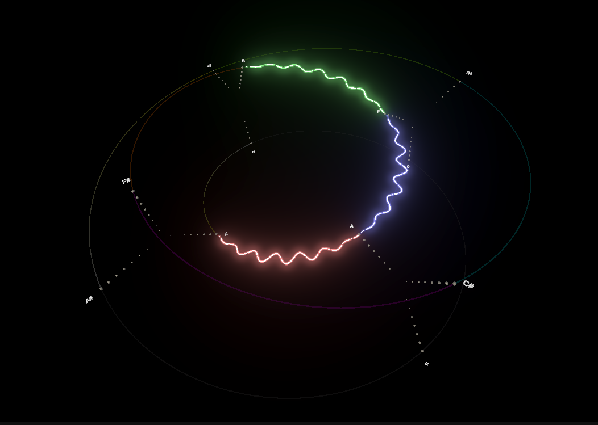

# Resonance 2

Interactive music theory visualization.

Umbilic Torus Circle of Fifths based on:
https://jimishol.github.io/post/tonality/

  

TODO:  
- Note coloring based on triple input of relative chords  
- Key detection  
- Key change rotation  