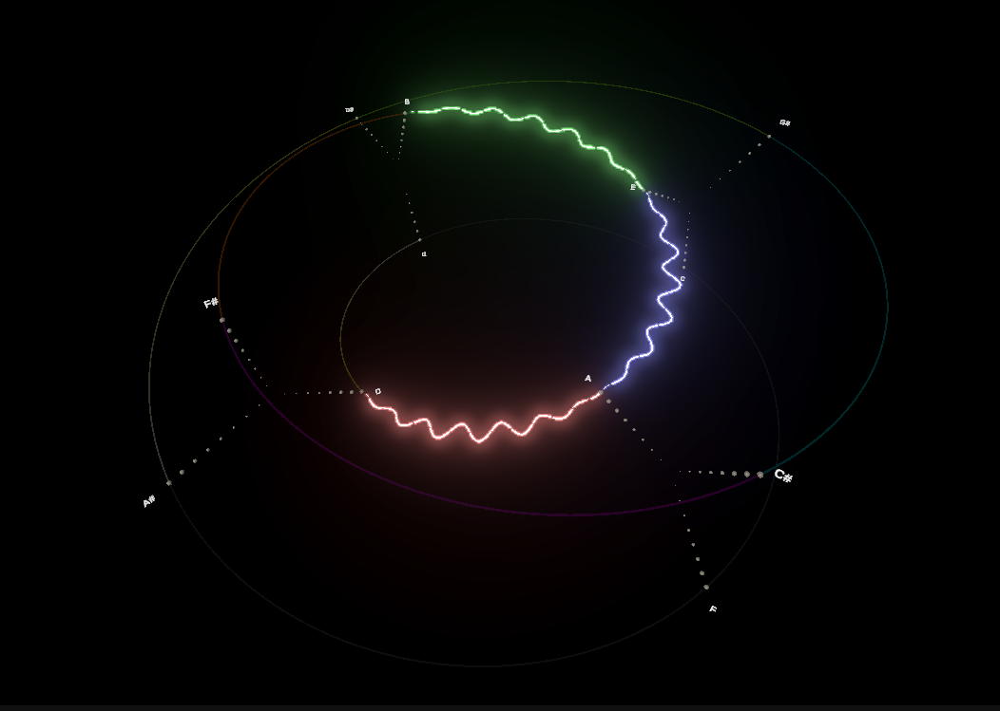

# Resonance 2

Interactive music theory visualization.

Umbilic Torus Circle of Fifths based on:
https://jimishol.github.io/post/tonality/

  

Open `Assets/Scenes/Resonance.unity` and enter Play Mode for the surface explorer,
guided progressions, MIDI transport, live Windows MIDI input, and view controls.

I/key is blue, IV is red, and V is green. Surface selection, tonal context, and
sounding notes are independent. Compatible collections are shown without
claiming an automatically established tonal key.

See [implementation and usage notes](IMPLEMENTATION-NOTES.md), the
[improvement plan](UMBILIC-IMPROVEMENT-PLAN.md) and the
[pattern wheel design](Docs/PATTERN-WHEELS.md): songs compressed to fundamental loops
and their variations, shown as a rack, pinion, planets and moons.

Validation: `dotnet run --project Tests/ModelChecks/ModelChecks.csproj`.
For scene checks, use **Tools → Resonance → Run runtime regression checks** in Play Mode.
